### Audit Expected Summary
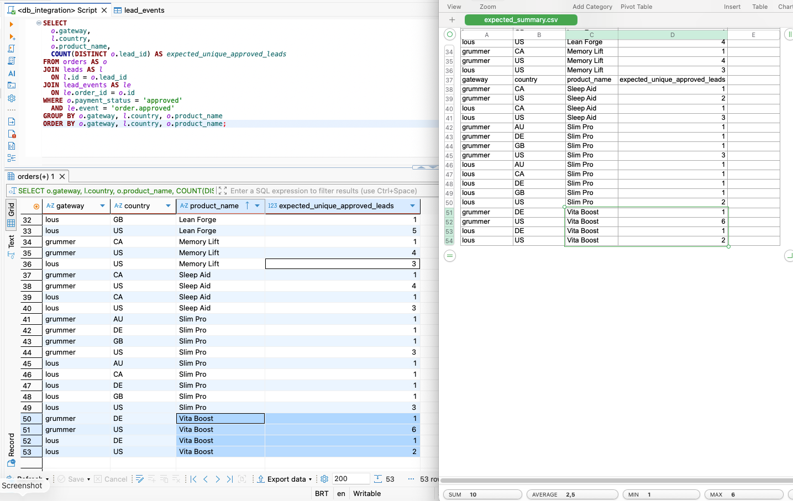

### Audit Query 1 Explain
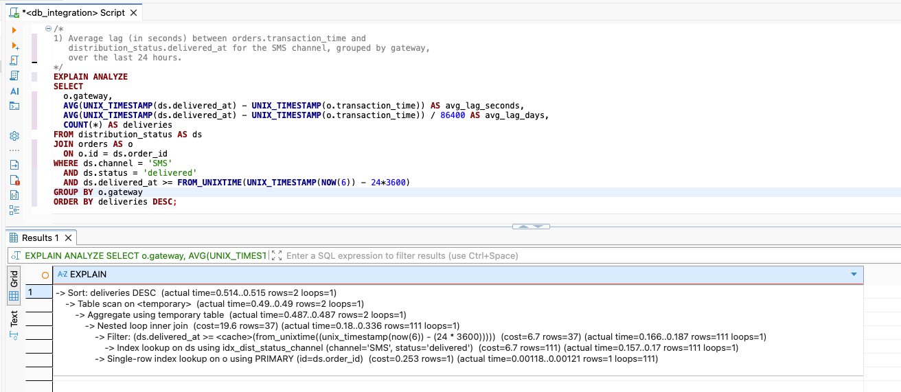

### Audit Query 1
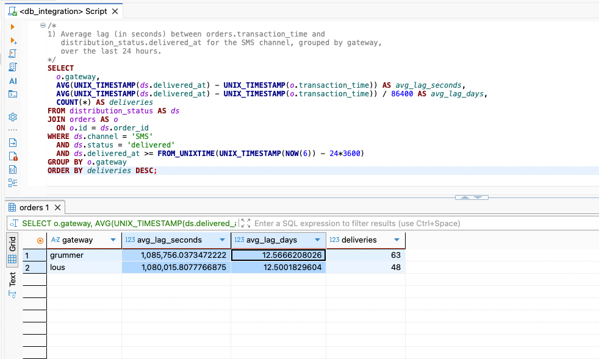

### Audit Query 2 Explain
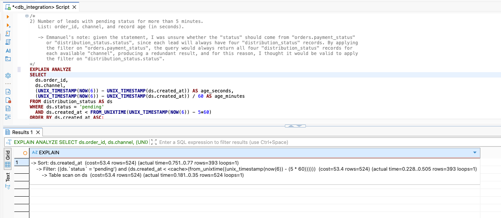

### Audit Query 2
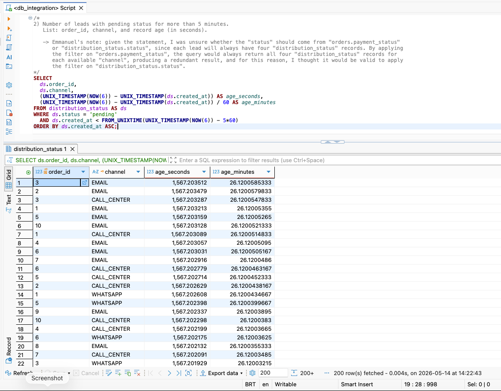

### Audit Query 3 Explain
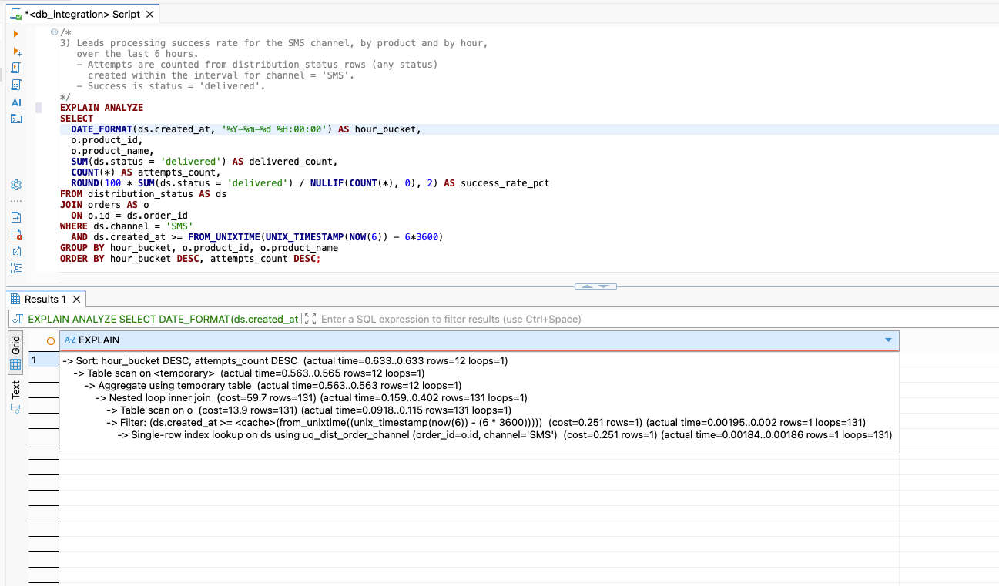

### Audit Query 3
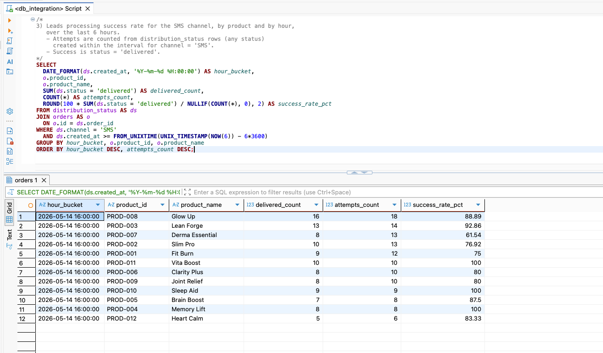

### Audit Query 4 Explain
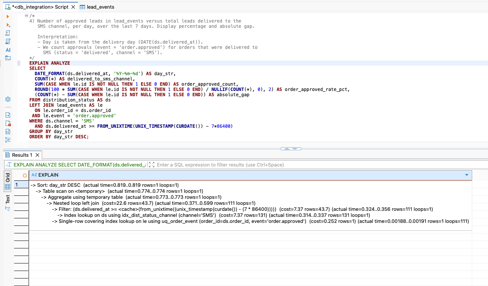

### Audit Query 4
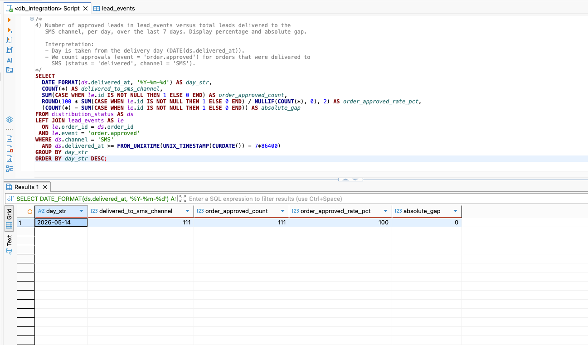

### DB Table Distribution Status
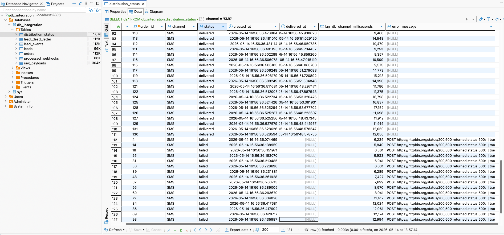

### DB Table Lead Dead Letter
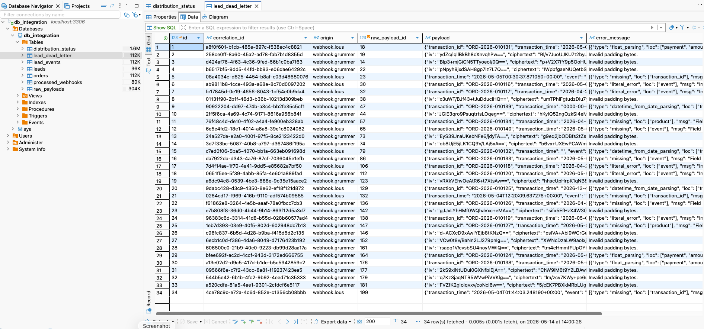

### DB Table Lead Events
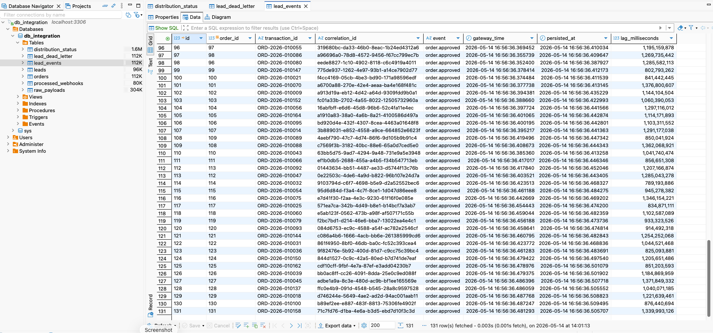

### DB Table Leads
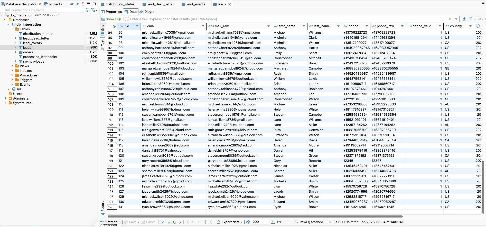

### DB Table Orders
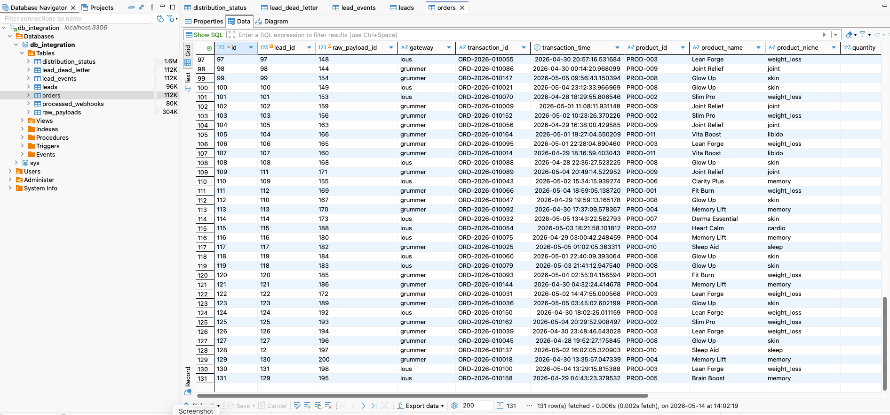

### DB Table Processed Webhooks
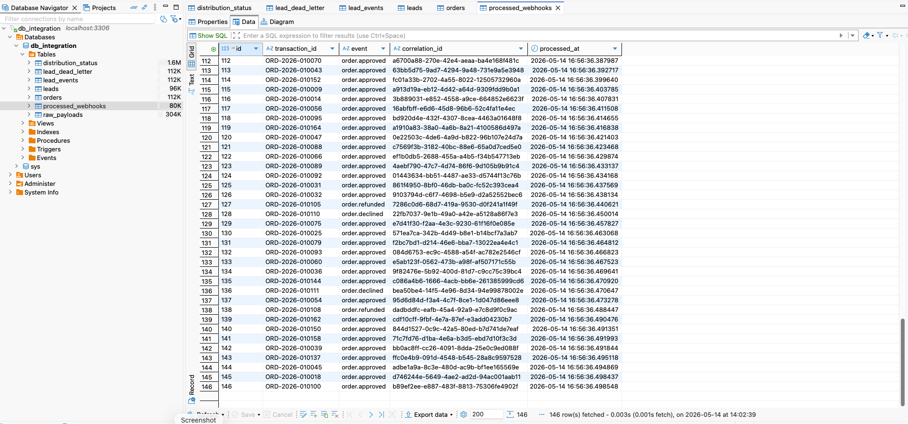

### DB Table Raw Payloads
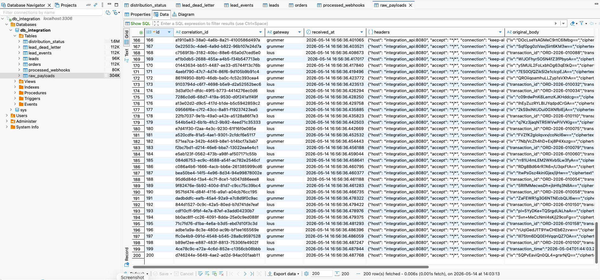
