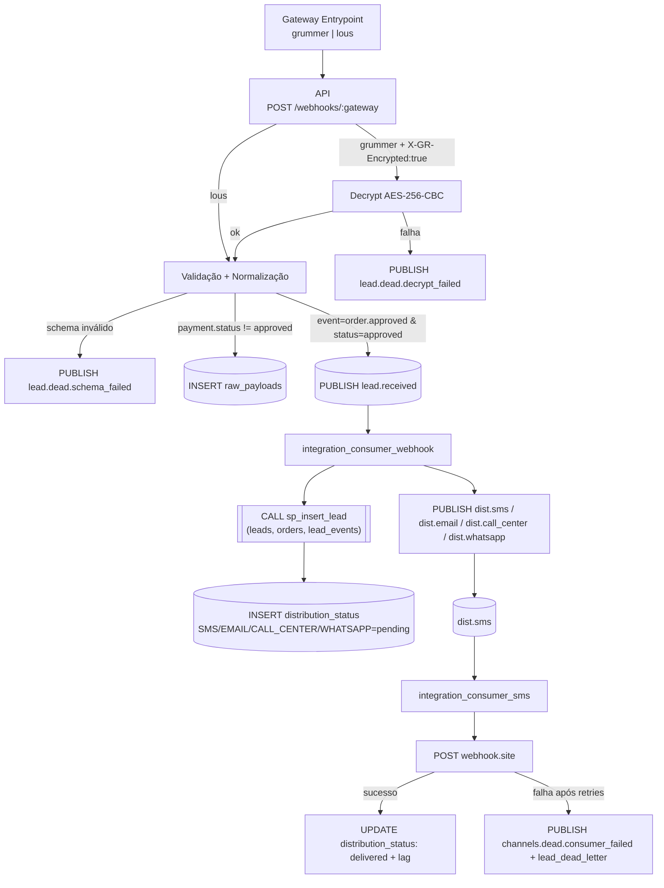

# GEX Corporation — Esteira de Integração (Resumo Técnico)

Este documento resume o fluxo end‑to‑end, decisões de arquitetura, premissas, justificativas de índices e escolhas de linguagem/bibliotecas adotadas neste desafio. O objetivo é receber webhooks de gateways, validar/normalizar, garantir idempotência, registrar para auditoria, publicar em filas e distribuir aos canais (implementado: SMS), com mecanismos de retry e DLQ.

## Visão geral do fluxo

## Decisões de arquitetura

- Optei por utilizar Python (com asyncio), ao invés de Golang, por ter mais familiaridade com o ecossistema Python. No entanto, não deixaria de cogitar Golang se o cenário exigisse, como por exemplo na necessidade de suportar o processamento de milhões de mensagens de forma verdadeiramente paralela (o modelo de concorrência do Golang, baseado em goroutines, lida melhor com paralelismo real do que o asyncio do Python, que opera em uma única thread).
- Consumers se conectam diretamente à base para evitar overhead de servidor (camada HTTP), em operações de CRUD.
- Utilização do Redis para reduzir consultas à base durante a verificação de idempotência pelo webhook.

## Justificativas dos índices (DDL principal)

- Consultas de auditoria (arquivo `integration_api/sql/audit/audit_queries.sql`):
  - Q1 — Lag médio de entrega de SMS nas últimas 24 horas.
  - Q2 — Entregas pendentes há mais de 5 minutos.
  - Q3 — Taxa de sucesso de SMS por produto e por hora (janela de 6 horas).
  - Q4 — Aprovados (tabela `lead_events`) vs. entregues (tabela `distribution_status`) por dia, últimos 7 dias.
  - Q5 — Resumo para exportação em CSV.

- Tabela `distribution_status`
  - Índice `idx_dist_channel_status_delivered_at (channel, status, delivered_at)`: impacto direto na Q1 — filtra `channel = 'SMS'` e `status = 'delivered'` e faz varredura por intervalo em `delivered_at` (24 horas). Na Q4 há aproveitamento parcial (prefixo pela coluna `channel`) somado a filtro em `delivered_at`, mesmo quando não há predicado em `status`.
  - Índice `idx_dist_status_created_at (status, created_at)`: impacto direto na Q2 — localiza de forma eficiente registros com `status = 'pending'` e `created_at < now() - 5 minutos`.
  - Índice `idx_dist_channel_created_at (channel, created_at)`: impacto direto na Q3 — contabiliza tentativas e resultados em `channel = 'SMS'` nas últimas 6 horas.
  - Restrição única `uq_dist_order_channel (order_id, channel)`: garante exatamente uma linha por pedido e por canal, evitando contagens duplicadas nas Q1, Q3 e Q4. Também disponibiliza acesso rápido por `order_id` para a junção com a tabela `orders`.
  - Índices de apoio `idx_dist_status_channel (channel, status)` e `idx_dist_created (created_at)`: podem ser escolhidos pelo otimizador quando a consulta não usa `delivered_at` como filtro principal; não são os índices prioritários das consultas Q1–Q4.

- Tabela `orders`
  - Chave primária `PRIMARY KEY (id)`: usada na junção com `distribution_status` em Q1, Q3 e Q5 (`distribution_status.order_id` → `orders.id`).
  - Restrição única `uq_orders_gateway_tx (gateway, transaction_id)`: reforça a idempotência de negócio (não é utilizada diretamente nas Q1–Q5).
  - Índice `idx_orders_product (product_id)`: auxilia as agregações por produto na Q3 após a junção; o impacto é menor quando o plano de execução é dirigido pela tabela `distribution_status`.
  - Índices `idx_orders_lead` e `idx_orders_raw_payload`: não são utilizados nas consultas Q1–Q5.

- Tabela `lead_events`
  - Restrição única `uq_order_event (order_id, event)`: impacto direto em Q4 e Q5 — permite busca rápida pelo evento `order.approved` para cada `order_id` na junção à esquerda.
  - Índice `idx_events_event_gateway_time (event, gateway_time)`: útil para janelas temporais por tipo de evento; não é essencial nas versões atuais de Q1–Q5, mas otimiza variações com filtro por tempo em `lead_events`.
  - Índices `idx_transaction_event (transaction_id, event)` e `idx_correlation_id (correlation_id)`: não usados em Q1–Q5; dão suporte a reconciliações e rastreamento por correlação ponta a ponta.

- Tabela `leads`
  - Índice `idx_leads_country (country)`: auxilia a Q5 na agregação por país (impacto moderado, pois a consulta não filtra por país).
  - Restrição única `uq_leads_email (email)`: garante canonicidade e idempotência do cadastro; sem impacto direto nas consultas Q1–Q5.

- Tabela `raw_payloads`
  - Índices `idx_correlation_id`, `idx_gateway`, `idx_received_at`: relevantes para auditorias sob demanda por correlação, por gateway e por janelas de recebimento.

- Tabela `processed_webhooks`
  - Restrição única `uk_transaction_event (transaction_id, event)` e índices por coluna: fundamentais para idempotência operacional e reconciliação do recebimento de webhooks.

- Tabela `lead_dead_letter`
  - Índices `idx_dlq_origin_created`, `idx_dlq_correlation`, `idx_dlq_raw_payload`: suportam inspeções da fila de descarte (DLQ) por origem, por tempo e por correlação.

## Escolhas de linguagem e bibliotecas

- Python (3.13): possibilidade de ecossistema assíncrono e velocidade de desenvolvimento.
- FastAPI + Uvicorn: performance adequada, tipagem, Pydantic 2.x, docs automáticas.
- Pydantic: validação de schema e configuração via ambiente.
- SQLAlchemy (na API) + aiomysql (consumidores): ergonomia na borda HTTP e baixo overhead em workers.
- RabbitMQ (aio‑pika): mensageria robusta com conexões tolerantes a falhas e `prefetch`.
- Redis: camada de cache distribuído, utilizado neste contexto para redzir consultas à base durante verificações de idempotência pelo webhook.
- aiohttp: cliente HTTP para performar requisições de forma assíncrona.

## Observações finais

- Atomicidade: `sp_insert_lead` realiza upsert de `leads`/`orders`/`lead_events` numa transação, evitando estados parciais e diminuindo contenção na camada de aplicação.
- Confiabilidade: retries + DLQ em todos os pontos de saída críticos (decrypt, schema, consumer de leads, distribuidor de canais). Tudo é auditável via `raw_payloads` e `lead_dead_letter`.
- Extensibilidade: novos canais exigem apenas um novo serviço `services/<canal>.py` registrado; o contrato de mensagem inclui `correlation_id` no payload publicado.
