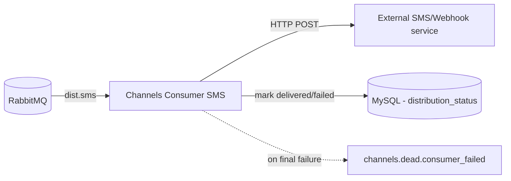

### integration_consumer_channels

Async RabbitMQ consumer for distribution channels. The repository currently implements the `dist.sms` handler that performs an outbound HTTP POST and marks distribution state in MySQL. The same pattern can be extended to `dist.email`, `dist.call_center`, `dist.whatsapp`.

#### Responsibilities
- Consume `dist.sms` messages.
- Perform the channel side‑effect (currently an HTTP POST to a demo endpoint).
- Update `distribution_status` for the corresponding `order_id` and `channel`:
  - `status = delivered`, set `delivered_at`, compute `lag_db_channel_milliseconds`.
  - On failure, `status = failed` and persist `error_message` with server‑side lag computation.
- Retry transient failures with exponential backoff; on final failure publish `channels.dead.consumer_failed`.

#### Flow



#### Message contract (incoming)
```json
{ "order_id": 1, "transaction_id": "tx-1", "channel": "SMS", "payload": { ... , "correlation_id": "<uuid>" } }
```

#### Environment variables
- `RABBITMQ_URL` RabbitMQ connection URL (required)
- `MQ_PREFETCH` Prefetch per consumer (default `10`)
- `DB_HOST` MySQL host (default `127.0.0.1` in code; `mysql` in Docker)
- `DB_PORT` MySQL port (default `3306`)
- `DB_USER` MySQL user (default `root`)
- `DB_PASSWORD` MySQL password
- `DB_NAME` Database name (default `db_integration`)
- `CONSUMER_CONCURRENCY` In‑process parallel handler tasks (default `10`)
- `LOG_LEVEL` e.g., `INFO`

#### Running

With Docker Compose (recommended):
```bash
docker compose up -d rabbitmq mysql
docker compose up -d integration-consumer-channels
```

Manual run:
```bash
python -m integration_consumer_channels.main
```

#### Notes
- Current HTTP target is a test endpoint (`webhook.site`), used only to simulate a side‑effect.
- On success/failure, the consumer updates `distribution_status` computing the lag in milliseconds between row creation and handling time.
- Dead letters are published to `channels.dead.consumer_failed`.
