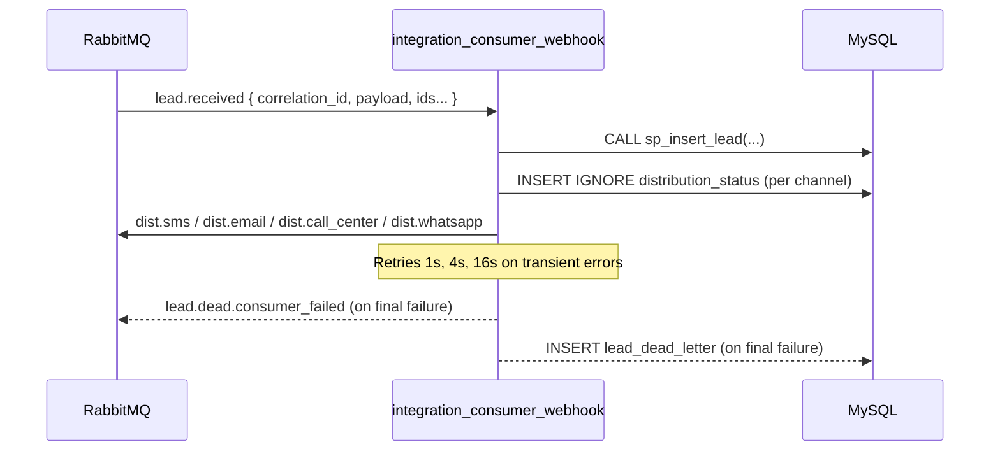

### integration_consumer_webhook

Async RabbitMQ consumer that ingests `lead.received` messages from the Integration API, persists domain data into MySQL using a stored procedure, ensures per‑channel distribution rows exist, and fans out messages to per‑channel queues (`dist.*`).

#### Responsibilities
- Consume `lead.received` from RabbitMQ.
- Parse envelope, extract normalized payload and metadata (e.g., `correlation_id`).
- Call MySQL stored procedure `sp_insert_lead` to atomically upsert into `leads`, `orders`, and `lead_events`.
- Ensure one `distribution_status` row per channel is present with status `pending`.
- Publish distribution messages to:
  - `dist.sms`
  - `dist.email`
  - `dist.call_center`
  - `dist.whatsapp`
- Retry transient failures with exponential backoff; on final failure publish `lead.dead.consumer_failed` and persist into `lead_dead_letter`.

#### Flow



#### Message contracts
- Consumes `lead.received` (envelope produced by Integration API):
  ```json
  {
    "correlation_id": "<uuid>",
    "id_raw_payload": 123,
    "id_processed_webhook": 456,
    "error_message": null,
    "gateway": "grummer|lous",
    "received_at": "2026-01-01T12:00:00+00:00",
    "payload": { "transaction_id": "...", "event": "order.approved", "customer": {"email": "..."}, "payment": {"status": "approved"}, "correlation_id": "<uuid>" }
  }
  ```
- Produces per‑channel distribution messages:
  ```json
  { "order_id": 1, "transaction_id": "tx-1", "channel": "SMS|EMAIL|CALL_CENTER|WHATSAPP", "payload": { ... , "correlation_id": "<uuid>" } }
  ```
- Dead letter on final failure: `lead.dead.consumer_failed` preserving the nested `payload` and correlation.

#### Environment variables
- `RABBITMQ_URL` RabbitMQ connection URL (required)
- `MQ_PREFETCH` Prefetch per consumer (default `10`)
- `DB_HOST` MySQL host (default `127.0.0.1` in code; `mysql` in Docker)
- `DB_PORT` MySQL port (default `3306`)
- `DB_USER` MySQL user (default `root`)
- `DB_PASSWORD` MySQL password
- `DB_NAME` Database name (default `db_integration`)
- `CONSUMER_CONCURRENCY` In‑process parallel handler tasks (default `10`)
- `LOG_LEVEL` e.g., `INFO`

#### Running

With Docker Compose (recommended):
```bash
docker compose up -d rabbitmq mysql
docker compose up -d integration-consumer-webhook
```

Manual run (ensure env vars are set and DB/migrations are applied):
```bash
python -m integration_consumer_webhook.main
```

#### Notes
- Concurrency is controlled by `CONSUMER_CONCURRENCY`; RabbitMQ prefetch is set via `MQ_PREFETCH`.
- Handler acks messages after processing completes (using `aio-pika` message context).
- Stored procedure and DDL live under `integration_api/sql/migration` and are mounted into MySQL by Docker Compose.
